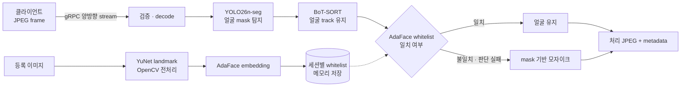

# InnoLive AI Face Processor

실시간 영상의 얼굴을 **세그멘테이션·추적**하고, 세션별 whitelist에 등록된 인물만
제외해 서버에서 모자이크 JPEG를 반환하는 gRPC AI 서버입니다.

`YOLO26n-seg`가 얼굴 mask를 만들고 `BoT-SORT`가 track을 유지합니다. 각 track은
`YuNet + AdaFace`로 whitelist와 비교되며, 확인되지 않은 얼굴은 서버에서
fail-closed 방식으로 보호됩니다.

## 핵심 기능

- **Mask-level 비식별화**: bbox가 아닌 instance mask 단위로 얼굴 영역을 정밀하게 합성
- **안정적인 실시간 추적**: stream별 BoT-SORT와 1-frame mask hold로 탐지 공백 완화
- **선택적 모자이크**: 세션별 AdaFace whitelist와 track cache를 이용해 등록 인물만 제외
- **Fail-closed 처리**: 인식·합성·전송 실패 시 원본 frame으로 되돌아가지 않음
- **환경별 가속**: YOLO는 TensorRT FP16 또는 PyTorch CUDA/MPS/CPU runtime 자동 선택
- **Streaming backpressure**: client W5 window, serialized inference, bounded AdaFace·mosaic lane

## 아키텍처



운영 진입점은 bidirectional streaming gRPC 서버인 `ai_processor_server.py`입니다.
App client는 gRPC를 직접 호출하고, 브라우저 demo만 `server.py`의 WebSocket gateway를
경유합니다. Gateway는 protocol만 변환하며 모델을 별도로 로드하지 않습니다.

## 기술 스택

- **데이터 구축 · 외부 학습 pipeline**
  - WIDER FACE bbox dataset
  - CVAT 기반 annotation 검수·가공
  - SAM 3.1을 이용한 bbox → segmentation mask 변환
  - 데이터 구축·학습 pipeline은 외부에서 관리하며, 이 저장소는 serving checkpoint와 runtime을 다룹니다.
- **얼굴 탐지 · 추적**
  - YOLO26n-seg: 640px, face 단일 class instance segmentation
  - BoT-SORT: stream-local multi-object tracking과 temporal mask hold
- **얼굴 인식 · 정렬**
  - AdaFace ViT-Base KP-RPE, WebFace12M: 512차원 face embedding과 cosine matching
  - YuNet ONNX + OpenCV: 5-point landmark 검출과 112×112 face preprocessing
- **추론 · 영상 처리**
  - TensorRT FP16: Linux x86_64 NVIDIA GPU 배포
  - PyTorch: CUDA, Apple Silicon MPS, CPU fallback
  - OpenCV · NumPy: image validation, mask 합성, Gaussian blur, JPEG encoding
  - ONNX: YuNet artifact와 TensorRT export pipeline의 model format
- **서빙 · 검증**
  - Python 3.12+ · `grpc.aio` · Protocol Buffers
  - FastAPI · Uvicorn · WebSocket: 선택적 browser demo
  - Ruff · unittest · Node.js test · transport benchmark

## 빠른 실행

### 1. 환경 구성

```bash
python3 -m venv .venv
.venv/bin/pip install -r requirements.txt
```

`models/best.pt`만으로 얼굴 segmentation과 전체 보호 모자이크를 실행할 수 있습니다.
Whitelist 기능에 필요한 AdaFace와 YuNet artifact는
[`models/README.md`](models/README.md)의 안내에 따라 준비합니다. Artifact가 없으면 서버는
모든 얼굴을 계속 보호하고 whitelist 등록 요청만 거부합니다.

### 2. gRPC 서버 실행

```bash
.venv/bin/python ai_processor_server.py
```

기본 endpoint는 `127.0.0.1:50051`입니다. `auto` 모드는 지원 환경에서 TensorRT engine
파일이 있으면 TensorRT를 선택하고, 그 외에는 PyTorch의 MPS → CUDA → CPU 순서로 device를
선택합니다. TensorRT를 선택한 뒤 검증에 실패하면 PyTorch로 fallback하지 않고 시작을
중단합니다.

CPU 실행을 강제하려면 다음 command를 사용합니다.

```bash
.venv/bin/python ai_processor_server.py --backend pytorch --device cpu
```

### 3. 브라우저 demo 실행

gRPC 서버를 실행한 상태에서 새 terminal을 엽니다.

```bash
.venv/bin/python server.py --grpc-target 127.0.0.1:50051
```

브라우저에서 `http://127.0.0.1:8001`을 열면 camera stream과 whitelist 등록 흐름을 확인할
수 있습니다.

### NVIDIA TensorRT

TensorRT engine은 실제 배포 대상인 Linux x86_64 NVIDIA 장비에서 생성합니다.

```bash
.venv/bin/pip install -r requirements-export.txt
.venv/bin/python -m scripts.export_tensorrt --device 0
.venv/bin/python ai_processor_server.py --backend tensorrt --device 0
```

Manifest는 build 환경을 기록하고, runtime은 serving profile·engine/checkpoint hash와
TensorRT version을 검증합니다. 기존 engine을 교체할 때만 export command에 `--force`를
추가합니다.

## API 요약

- `ProcessVideo`: JPEG frame과 처리된 JPEG·face metadata를 주고받는 bidirectional stream
- `AddWhitelist` · `DeleteWhitelist` · `GetWhitelistStatus`: 세션별 face exemplar 관리
- `CreateSession` · `ListSessions` · `DeleteSession`: in-memory session lifecycle 관리
- Python client: `grpc_client.VideoProcessorClient`

등록 이미지는 저장하지 않고 정규화된 AdaFace embedding만 메모리에 유지합니다. 자세한
message field와 RPC 계약은 [`protos/ai_processor.proto`](protos/ai_processor.proto)를
참고합니다.

> gRPC 서버 자체에는 인증이 없습니다. 외부 공개 시 private network 또는 authenticated
> proxy 뒤에서 사용해야 합니다.

## 검증

```bash
.venv/bin/pip install -r requirements-test.txt
.venv/bin/ruff check .
.venv/bin/ruff format --check .
.venv/bin/python -m unittest discover -s tests
node tests/test_web.mjs
```

배포 GPU용 `scripts/benchmark_grpc.py`는 30 FPS, server p95 33.3 ms 이하와 W5 ordering을
acceptance target으로 검사합니다. 이는 보장된 성능 수치가 아니므로 실제 sequential
validation video와 배포 환경에서 다시 측정해야 합니다.

## 프로젝트 구조

```text
.
├── ai_processor_server.py   # AI gRPC server와 session lifecycle
├── grpc_client.py           # bounded async Python client
├── server.py                # browser ↔ gRPC demo gateway
├── service/
│   ├── runtime.py           # YOLO 및 TensorRT/PyTorch backend 선택
│   ├── tracking.py          # stream-local BoT-SORT
│   ├── adaface_*.py         # AdaFace backbone과 YuNet runtime
│   ├── recognition.py       # session whitelist와 track decision cache
│   ├── frame.py             # bounded image validation/decode
│   ├── mosaic.py            # mask union, blur, JPEG 합성
│   └── protocol.py          # browser WebSocket binary codec
├── protos/                  # gRPC schema와 generated Python stubs
├── models/                  # checkpoint와 runtime artifact 안내
├── config/                  # BoT-SORT 설정
├── scripts/                 # TensorRT export와 acceptance benchmark
├── tests/                   # Python·Node 회귀 테스트
├── web/                     # browser demo client
```

## 라이선스

별도 표시된 제3자 구성요소를 제외하고, 이 저장소에서 자체 작성한 source code는
[GNU Affero General Public License v3.0 only](LICENSE)로 배포합니다. Ultralytics runtime과
YOLO 학습 checkpoint도 upstream의 기본 AGPL-3.0 조건을 따릅니다. 수정본을 network
service로 운영할 때에는 AGPL v3 제13조에 따라 원격 사용자에게 해당 version의
Corresponding Source를 받을 수 있는 방법을 제공해야 합니다.

모델과 학습 데이터의 권리는 source code 라이선스와 별도로 확인해야 합니다. 특히
`models/best.pt`는 WIDER FACE 기반 학습 이력이 있으므로, 이 저장소의 AGPL 표시는 해당
checkpoint의 상업적 이용 가능성을 보증하지 않습니다. 상업 배포 전에는 WIDER FACE 관련
권리를 별도로 검토하거나, 용도가 명확히 허용된 데이터로 다시 학습한 checkpoint로
교체해야 합니다. Ultralytics, WIDER FACE, SAM 3.1, AdaFace, YuNet 관련 범위와 고지는
[THIRD_PARTY_NOTICES.md](THIRD_PARTY_NOTICES.md)를 참고하세요.
