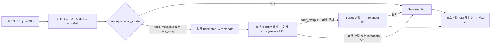

# metadata 프리셋 기반 experimental 얼굴 합성

메인 `ProcessVideo`에서 YOLO segmentation과 BoT-SORT, AdaFace whitelist 처리를 마친
얼굴에 metadata 추출과 프리셋 매칭을 연결한다. 프리셋이 아직 없는 상태에서도
metadata와 identity 할당 결과를 확인할 수 있다.

## 요청 모드

| `VideoChunk.anonymization_mode` | Python `VideoFrame.anonymization_mode` / 클라이언트 `--mode` | 동작 |
| --- | --- | --- |
| `FACE_ANONYMIZATION_MODE_BLUR` (0, 생략) | `blur` | 기본 Gaussian blur; experimental 모델 로딩 없음 |
| `FACE_ANONYMIZATION_MODE_FACE_METADATA` (2) | `face_metadata` | metadata 추출·프리셋 매칭 결과 반환, 화면은 blur |
| `FACE_ANONYMIZATION_MODE_FACE_SWAP` (1) | `face_swap` | metadata 추출·프리셋 매칭 후 InSwapper-128 합성; 실패한 얼굴은 blur |

모드는 한 `ProcessVideo` RPC 동안 고정한다. 바꾸려면 새 RPC를 연다. 기본
`MosaicConfig.pixel_size`는 1이며 `blur_radius`는 24px이다. pixelation이 필요하면
기존 `mosaic_config.pixel_size`로 2..8을 전달한다. 기존 field 번호와 RPC 경로는 유지한다.
`VIDEO_OUTPUT_MODE_MOSAIC_JPEG`라는 기존 이름도 유지하며 합성 모드에서는 합성된 JPEG를
반환한다. `VIDEO_OUTPUT_MODE_METADATA_ONLY`에서는 선택한 experimental 모드의 metadata와
매칭 결과만 반환하며 InSwapper를 실행하지 않는다. raw `yuv420p` 입출력도 지원한다.



## 트랙과 프리셋 계약

처음 metadata를 얻은 BoT-SORT track에서 `gender`, `age`와 1..5 중 무작위 identity slot을
고정한다. 이후 매 프레임 `glasses`, `exp`를 다시 추출해 같은 identity의 해당 variant를
찾는다. `gender`나 `age` 예측이 흔들려도 첫 bucket을 유지하므로 identity가 바뀌지 않는다.
관측된 최신 속성은 응답에 그대로 기록하며 고정된 bucket은 `identity_key`에 기록한다.

- identity key: `female/20s/3`
- variant key: `female/20s/3/on/happy`
- 동일 `gender/age/identity`의 모든 표정·안경 프리셋은 같은 가짜 인물이어야 한다.
- 전체 구성: 2 genders × 4 ages × 5 identities × 2 glasses × 7 expressions = 560 images
- RPC마다 별도 identity state 보유; 같은 `session_id`의 서로 다른 RPC도 독립된 tracker와 state 보유
- 트랙 부재 시 기본 30 frames 유지; `--face-identity-retention-frames`는 BoT-SORT `track_buffer` 이상으로 설정
- held mask는 새 metadata나 합성을 실행하지 않고 blur 처리; 기존 identity state 유지
- RPC 종료 시 state 정리; 재접속 후 기존 identity 유지나 사람 재식별은 범위 밖
- 다른 트랙이 같은 slot을 선택할 수 있음; 현재 5개 identity pool에서 전역 유일성 보장 없음

`config/face_presets.json`은 빈 catalog로 배포한다. 이미지가 준비되는 대로 아래 entry를
추가한다. 이미지 경로는 manifest 디렉터리를 기준으로 상대 경로이며 그 디렉터리 밖으로
나갈 수 없다. 기본 위치에서는 `config/face_presets/` 아래에 이미지를 놓는다.
이 이미지 디렉터리는 Git에서 제외되어 있으므로 배포할 때 별도로 전달한다.
다른 위치의 manifest는 `--face-preset-manifest`로 지정할 수 있다.

```json
{
  "schema_version": 1,
  "presets": [
    {
      "gender": "female",
      "age": "20s",
      "identity": 3,
      "glasses": "off",
      "exp": "none",
      "image": "face_presets/female/20s/3/off/none.png"
    },
    {
      "gender": "female",
      "age": "20s",
      "identity": 3,
      "glasses": "on",
      "exp": "happy",
      "image": "face_presets/female/20s/3/on/happy.png"
    }
  ]
}
```

일부 조합과 identity만 존재해도 catalog를 로드한다. 현재 track에 할당된 slot의 정확한
variant가 없으면 `preset_missing`으로 blur 처리한다. 다른 identity나 이전 표정으로
대체하지 않는다. entry 중복, 속성 오타, 1..5 밖의 slot, 잘못된 경로는 로딩 실패로 처리한다.
Catalog와 모델은 프로세스에서 공유하며 첫 experimental 요청에서 로드한다.
프리셋이나 모델을 교체하거나 초기 로딩 실패를 수정한 뒤에는 서버를 재시작한다.

## 모델과 자원

`models/face_metadata_extracter.pt`는 사용자가 추가한 파일명을 그대로 사용한다.
checkpoint의 `config`와 `model` state dict를 읽고 class 순서를 검증한 뒤 strict 로딩한다.
backbone은 torchvision MobileNetV3-Large features, GAP 뒤 독립적인 `960 → 128 → C`
head 4개이다. `input_size=224`, targets는 `gender`, `age`, `glasses`, `exp` 순서이다.
`torch.load(weights_only=True)`를 유지하며 checkpoint에 포함된 NumPy RNG를 위한 구체적인
NumPy primitive만 allowlist한다. optimizer와 RNG state는 추론에 사용하지 않는다.

checkpoint는 normalization과 head activation을 기록하지 않는다. 현재 구현은 bbox crop을
224×224로 resize하고 BGR → RGB, 0..1, ImageNet mean `(0.485, 0.456, 0.406)` /
std `(0.229, 0.224, 0.225)`를 적용하며 head는 ReLU를 사용한다. Dropout은 eval에서 비활성이다.
**학습 코드와의 preprocessing 및 activation 일치와 분류 정확도는 추가 확인 대상이다.**
추론 smoke 통과가 분류 정확도 검증을 의미하지 않는다.

InSwapper adapter는 optional ONNX Runtime와 ONNX만 사용한다. 기존 Tk 실험 클라이언트의
InsightFace dependency를 메인 서버에 강제하지 않는다. 기본 CPU이고 NVIDIA에서
`--face-swap-provider cuda`를 명시한다. CUDA provider가 없으면 swap을 실행하지 않고 blur로
돌아간다. 모델을 자동 다운로드하지 않는다.

| artifact | 기본 경로 | 용도 |
| --- | --- | --- |
| metadata checkpoint | `models/face_metadata_extracter.pt` | 속성 분류 |
| InSwapper | `models/face_swap/inswapper_128.onnx` | 128px 얼굴 합성 |
| ArcFace | `models/face_swap/w600k_r50.onnx` | 프리셋 identity embedding |
| YuNet | `models/face_detection_yunet_2023mar.onnx` | source/target 5-point landmarks |

기존 `~/.insightface/models/buffalo_l/w600k_r50.onnx`를 사용하려면 서버에
`--face-swap-arcface`로 그 파일을 명시하거나 기본 경로에 복사한다. source image는
YuNet이 정확히 한 얼굴을 찾을 수 있어야 한다. source latent는 variant image별로
최대 64개까지 캐시한다. target landmarks는 현재 YOLO bbox ROI에서 IoU로 연결한다.
합성은 해당 얼굴 segmentation polygon 안으로 제한하고, 실패한 얼굴·held 얼굴·번호판의
blur를 마지막에 적용한다. whitelist 얼굴은 기존 정책대로 보호 처리에서 제외한다.

기존 serialized composition executor와 최대 2개의 inflight slot에서 metadata·합성을
실행한다. 기본 blur 경로에 추가 모델을 올리지 않으며, 스트림 취소 시 worker가 끝난 뒤
identity와 tracker state를 정리한다. YOLO backend와 swap provider는 독립적이다.
현재 swap adapter는 ONNX이며 기존 lab의 TensorRT swap engine을 사용하지 않는다.
`timing.blur_encode_ms`에는 experimental metadata·합성·인코딩 시간이 포함된다.
첫 요청에는 모델 로딩 시간도 포함되므로 테스트 RPC deadline에 여유를 둔다.

InSwapper는 source 이미지의 **identity embedding**을 입력으로 사용한다.
[원본 구현](https://github.com/deepinsight/insightface/blob/master/python-package/insightface/model_zoo/inswapper.py)
역시 source의 표정이나 안경을 직접 제어하는 입력을 받지 않는다. 이 구현은 현재 속성에
맞는 variant를 즉시 선택하지만, 그 variant의 표정·안경이 출력에 정확히 재현되는 것은
보장하지 않는다. 실제 합성의 identity 일관성과 안경·표정 보존은 완성된 가짜 얼굴
프리셋과 실제 영상으로 별도 평가해야 한다.

## 서버와 테스트 클라이언트

metadata 확인은 기존 서버 dependencies만 필요하다. 합성할 호스트에서는 추가로 설치한다.

```bash
.venv/bin/python -m pip install -r requirements-face-swap.txt
.venv/bin/python ai_processor_server.py --backend pytorch \
  --face-swap-arcface "$HOME/.insightface/models/buffalo_l/w600k_r50.onnx"
```

NVIDIA 배포 호스트는 CPU `onnxruntime` 대신 해당 CUDA/cuDNN 환경에 맞는
`onnxruntime-gpu`를 설치하고 서버에 `--face-swap-provider cuda`를 전달한다.
metadata도 CUDA에서 실행하려면 `--face-metadata-device cuda:0`를 별도로 전달한다.
기본 metadata device는 CPU다.

테스트 클라이언트는 메인 서버의 실제 gRPC `ProcessVideo`를 호출한다. 모델을 클라이언트에
올리지 않으므로 배포 서버에도 `--target`만 바꿔 같은 경로로 시험할 수 있다.
GUI에서 track ID, identity, 현재 안경·표정, 처리 상태와 fallback 사유를 표시하고,
stdout에는 전체 protobuf metadata를 JSON으로 기록한다. q 또는 Esc로 종료한다.

```bash
# 기본 blur
.venv/bin/python scripts/face_preset_client.py --camera 0

# 프리셋 완성 전 metadata와 identity 확인
.venv/bin/python scripts/face_preset_client.py --camera 0 --mode face_metadata

# experimental 합성
.venv/bin/python scripts/face_preset_client.py --camera 0 --mode face_swap

# 이미지 3장을 같은 RPC에 반복 전송; 화면 없이 결과와 metadata 저장
.venv/bin/python scripts/face_preset_client.py --image /path/to/face.jpg \
  --frames 3 --mode face_metadata --headless --output-dir face_preset_client_output

# 배포 서버의 영상 입력; TLS 사용 시 --root-cert /path/to/ca.pem 추가
.venv/bin/python scripts/face_preset_client.py --target host:50051 \
  --video /path/to/video.mp4 --mode face_swap --frames 300
```

`--output-dir`를 명시한 경우에만 `metadata.jsonl`과 마지막 서버 출력 `last.jpg`를 저장한다.
입력은 기본 long edge 640으로 resize하며 `--long-edge`로 변경할 수 있다.
기존 browser demo는 계속 기본 blur를 요청한다. experimental 시험은 이 클라이언트 또는
`VideoFrame(..., anonymization_mode="face_swap")`을 사용하는 Python SDK로 실행한다.
SDK는 얼굴이 있는 opt-in 응답에 새 anonymization metadata가 없으면 구버전 서버로 판단해
오류를 반환한다. 프리셋 누락으로 인한 정상 blur fallback과 구버전 서버를 구분할 수 있다.

## 응답 확인

`faces[].anonymization`에는 `attributes.{gender,age,glasses,exp,confidence}`,
`identity_key`, `preset_key`, `status`, `fallback_reason`이 들어간다.
기본 blur·whitelist·번호판에는 이 experimental message를 넣지 않는다.

| status / reason | 의미 |
| --- | --- |
| `swapped` | 프리셋과 InSwapper 실행 성공 |
| `metadata_only` | 프리셋 매칭 성공; 선택한 output/mode에 따라 합성 생략 |
| `blur_fallback` / `preset_missing` | 정확한 slot/variant entry 또는 이미지 부재 |
| `blur_fallback` / `metadata_unavailable` | checkpoint/catalog 로딩 또는 metadata 추론 실패 |
| `blur_fallback` / `face_too_small` | bbox crop의 짧은 변이 16px 미만 |
| `blur_fallback` / `untracked_face` | 속성 추출은 성공했으나 track ID 부재 |
| `blur_fallback` / `held_face` | 실제 탐지 없는 held mask |
| `blur_fallback` / `swapper_unavailable` | 모델/optional dependency/provider 로딩 실패 |
| `blur_fallback` / `swap_failed` | source/target alignment 또는 합성 실패 |

프리셋이 없어도 attributes와 identity가 반환되며 출력은 blur다. 합성과 fallback 모두
실패하여 보호 mask를 구성할 수 없는 프레임은 기존 `MOSAIC_FAILED` 계약대로 pixel data를
반환하지 않는다.

## 이번 구현의 검증 범위

2026-10-04 macOS arm64, CPU에서 다음 항목을 확인했다.

- `python -m unittest discover -s tests`: 215 tests 통과; 신규 20 tests에 트랙 identity 고정,
  동적 variant 변경, 부분 catalog, 실패 fallback, whitelist/번호판/held 제외, raw 출력,
  SDK opt-in, 모드 변경 거부, 구버전 응답 거부, 실제 loopback 클라이언트와 취소 정리 포함
- 변경된 코드 Ruff check 및 format check 통과; `node tests/test_web.mjs` 통과
- 실제 checkpoint strict 로딩 및 4개 head 추론, 실제 YuNet/ArcFace/InSwapper ONNX 추론 통과
- 메인 `ai_processor_server.py`를 CPU YOLO backend로 실행하고 테스트 클라이언트에서
  blur/face_metadata/프리셋 없는 face_swap 모드 각각 동일 입력 3프레임 확인
- 빈 catalog에서 metadata와 고정 identity, `preset_missing`과 blur JPEG 확인
- 임시 fixture catalog를 지정한 별도 메인 서버에서 실제 합성 3프레임 `swapped`,
  동일 track과 `female/over40s/4` identity 유지, JPEG decode 확인

smoke 입력과 source는 설치된 Matplotlib의 `grace_hopper.jpg` sample image이다.
임시 fixture는 routing 검증용으로 같은 이미지를 여러 slot과 variant에 연결했으며
실제 5개 가짜 인물 프리셋을 의미하지 않는다. fixture와 테스트 출력은 저장소에 포함하지
않는다. 메인 서버 smoke에서는 whitelist 모델을 비활성으로 두고 보호 대상 경로를
검증했으며 whitelist 동작은 기존 회귀 테스트로 확인했다.

3프레임 CPU smoke는 성능 benchmark가 아니다. 첫 합성 프레임은 약 5.44초,
이후 두 프레임은 약 1.36초와 1.20초였으며 모델 로딩과 단일 sample의 처리 결과이다.
전체 프리셋에서 서로 다른 실제 identity의 일관성, 표정·안경의 시각적 재현, live webcam,
분류 정확도 및 CUDA/TensorRT 배포 성능은 검증하지 않았다.

저장소 전체 `ruff check .`에는 변경하지 않은 `.agent/.claude/.codex`의 wiki-update
scripts와 기존 TensorRT lab의 lint 오류 23개가 남아 있다. 전체 format check에도
변경하지 않은 `tests/test_trt_swap_client.py` 1개가 남아 있으며 해당 파일은 이번 범위에
포함하지 않았다.
